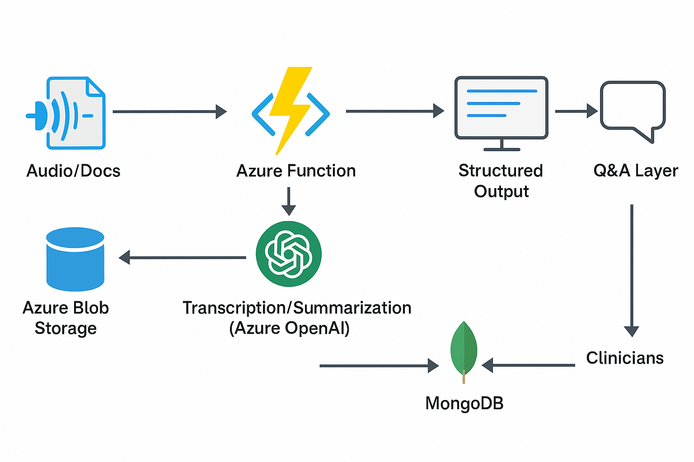

# 🩺 Medistory

**Where Every Patient Record Becomes a Clear Medical Story — Powered by AI**

Medistory is an AI-driven clinical assistant that transforms unstructured patient data—such as voice notes and documents—into structured, searchable, and summarized medical records. Built on Azure cloud and OpenAI technologies, it automates clinical documentation, accelerates diagnosis workflows, and empowers clinicians with real-time, natural-language patient insights.

## Features

**Automated Summarization**  
- Converts unstructured text into concise clinical summaries  
- Highlights key medical events, diagnoses, and treatments  
- Adaptable to various medical specialties  

**Real-Time Q&A**  
- Ask natural-language questions like:  
  > "Has the patient had any allergic reactions before?"  
- AI responds with accurate context-aware answers from the patient history  

**Audio-to-Note Conversion**  
- Automatically transcribes clinical audio using Azure Speech-to-Text  
- Transforms speech into structured **SOAP** notes with GPT-4  
- Enables hands-free, efficient documentation  

## System Architecture

**High-Level Workflow:**  
Audio/Docs → Azure Blob Storage → Azure Function (Trigger)  
→ Transcription/Summarization (Azure OpenAI) →  
Structured Output → MongoDB + Dashboard + Q&A Layer

**Component Stack**

| Layer        | Technology Stack                                |
|--------------|--------------------------------------------------|
| Frontend     | React.js, Bootstrap UI                          |
| Backend      | Azure Functions (serverless), Flask (dev mode) |
| AI/NLP       | Azure OpenAI (GPT-4), Azure Speech-to-Text     |
| Storage      | Azure Blob Storage (files), MongoDB (metadata) |
| DevOps       | GitHub Actions, Azure CLI                      |

## How It Works

1. Upload audio or medical documents via an intuitive frontend.
2. Azure Functions are triggered to:
   - Transcribe audio (if present)
   - Summarize medical content
   - Format it into SOAP notes
3. All data is stored securely in Azure Blob + MongoDB
4. Clinicians can query the patient's history in natural language, with GPT-4 answering in real time.

## Current Limitations

- Requires high-quality audio/text for best performance  
- Lacks formal clinical validation  
- HIPAA/GDPR compliance in progress  
- Offline access not yet supported  
- GPT-4 may occasionally hallucinate medical facts  

## Future Enhancements

- Mobile App for bedside documentation  
- Multilingual Support  
- Analytics Dashboard to track documentation trends  
- EHR Integration via FHIR APIs (Epic, Cerner)  
- Role-Based Access Control (Admin, Auditor, Doctor)  

## 👥 Team Medistory

**Mentors**  
Varsha · Asvataman 

**Mentees**  
Harshitha · Soundariyan · Nithyashree · Leo · Soujanya · Sriman

## Built With

- Azure OpenAI (GPT-4)  
- Azure Speech-to-Text  
- Azure Functions, Blob Storage  
- Flask, React.js, MongoDB  
- GitHub Actions, Azure CLI  

